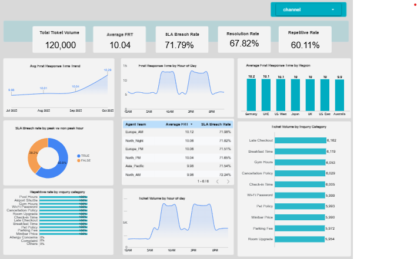

# GrandStay Hospitality: Operations Insights & Analytics

  

### <a href="https://hospitality-operations.streamlit.app/" target="_blank"> Live Dashboard: GrandStay Analytics App</a>

##  Business Context
GrandStay Hospitality Group (GSH) operates more than **8,000 properties across 130 countries**, spanning luxury, business, and extended-stay segments. 

As guest expectations evolved toward 24/7 digital responsiveness, GSH’s traditional support model began experiencing operational strain. This project was initiated to address:
* **Rising Inquiry Volumes:** Scaling support without linear head-count growth.
* **SLA Breaches:** Managing peak-hour delays and service inconsistency.
* **Knowledge Gaps:** Ensuring uniform interpretation of global guest policies.

---

## Purpose of the Project
The goal is to build a comprehensive operational baseline that quantifies **Time, Scale, and Cost** inefficiencies using structured enterprise data. 

### Key Objectives:
1. **Measure Efficiency:** Quantify response time delays and SLA reliability.
2. **Automation Discovery:** Identify repetitive inquiries suitable for the *Intelligent Travel Concierge* initiative.
3. **Financial Impact:** Calculate cost-per-contact and overtime dependency.
4. **Benchmarking:** Design a pre- vs. post-deployment measurement framework for AI integration.

---

## Analytics Framework
The accompanying dashboard provides a defensible data model focusing on several high-impact KPIs:
* **SLA Breach Rate:** Identifying where service levels fail to meet guest expectations.
* **Repetitive Inquiry Rate:** Isolating the % of tickets that can be resolved via automation.
* **Category Distribution:** Segmenting inquiries by type (Booking, Billing, Service) to prioritize AI training.

---

## Technology Stack
- **Data Visualization:** Looker Studio
- **Web Framework:** Streamlit (Python)
- **Deployment:** GitHub & Streamlit Cloud